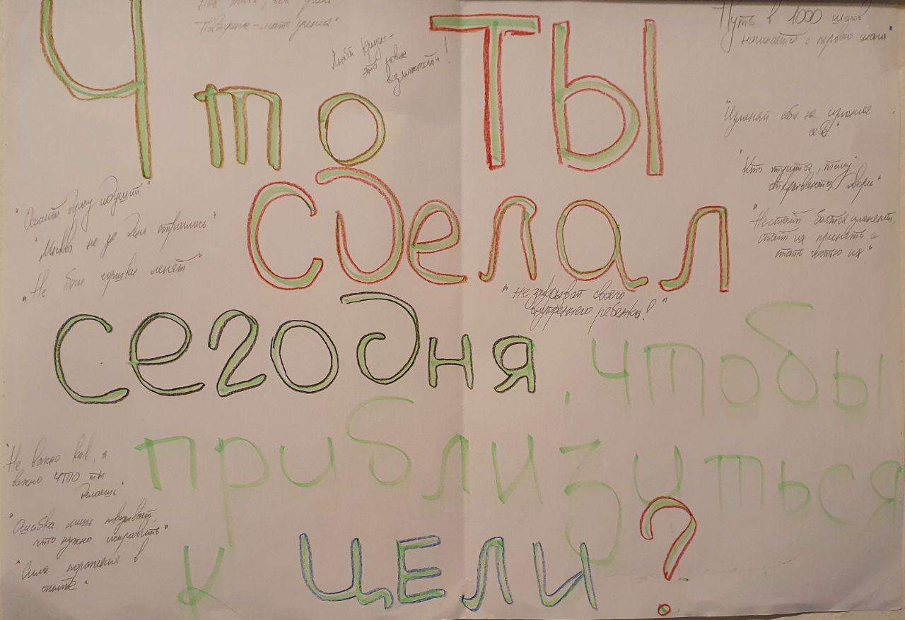

# Как я стал программистом

Данный пост является попыткой осмыслить процесс трансформации из "обычного" человека в "айтишника", а заодно и развенчать некоторые мифы, ходящие об этой сфере.
Содержимое статьи является сугубо субъективным мнением автора, и ни в коем случае не претендует на роль истины.

## Вместо введения

Приходилось слышать расхожее мнение типа "айти для молодых", "айтишнику обязательно знать математику", "айти это сложно" и т.д/т.п?
Здесь я попытаюсь через личную историю показать, что это не совсем так, а скорее даже совсем не так.
Если непреодолимое желание закрыть эту статью не возникло, милости просим, будет интересно)

**Краткая история**

Привет всем, меня зовут Рома, мне 33, я из Беларуси, живу в Праге (звучит как начало встречи в клубе анонимных алкоголиков:))
Желание поменять что-то в жизни возникало на протяжении нескольких последних лет, однако пресловутые "я уже много сделал на этом месте", "а ведь и тут неплохо", "я что, зря учился??" и подобные, а по сути - страх перемен, сковывали движения, не давая двигаться вперед. Для меня, успевшего поучиться и освоив несколько профессий, это выглядело "сильным" аргументом и надежным оправданием. Время шло, и внутреннее напряжение накапливалось, несмотря на всяческие попытки игнорировать или не замечать проблему. Как результат - отсутствие мотивации работать и приступы все бросить, и уйти в монастырь. Последней каплей стал момент, когда в начале рабочего дня испытал чувство полной апатии, переходящей в отвращение. Так я понял - пришло время что-то менять в жизни.
Все началось с малого - по работе пришло задание, где вручную нужно было переименовать много элементов 3D модели, с большими затратами на внимательность, или попросту “обезьянья работа” . После получаса тыкания руками возникла идея - почему бы не автоматизировать процесс? И вправду почему нет, ведь выгоды налицо - экономия времени, да и задачка новая.. Быстрый звонок другу, осуществимо-ли - осуществимо. Поехали. Как это сделать?? Ответ прост и тривиален - сформулировать задачу и реализовать это с помощью какого-либо языка программирования. И если с первым проблем не возникло, то второе вогнало в ступор - я и язык программирования, шутите? Здесь, как говорится, главное не вешать нос и обратиться по адресу. В моем случае это друг программист Серега , который согласился помочь. Фу, полдела сделано! Попутно вспоминаю, что в универе был курс по Python, и даже помню как установить и запустить его, что и делаю. При встрече большую часть времени заняло объяснение, что же я хочу, и через час на руках был готовый скрипт, который в прямом смысле делал магию - экономил 4 дня рабочего времени!!! Первый шаг сделан, и проникшись возможностями автоматизации, стал погружаться в тему.

Следующее задание не заставило долго ждать - тот же друг Серега прошел тренинг по определению персональности предложил сделать консольное приложение приложение на Python. Вдохновившись предыдущим успехом, засел за код, и через несколько дней все было готово (Google и друзья в помощь). Важно отметить, процесс не был гладким, однако, решая возникшие вопросы постепенно, все получилось!
Когда все было готово, Серега подкинул идею - коли так все пошло, сделай веб приложение как pet project, чтоб любой мог пройти тест, заодно поймешь, о чем это "айти". Легкодумно согласившись, я подписался на (не)долгий, и местами (не)приятный процесс трансформации, в результате которого стал "одним из".
Не имея никакого опыта программирования, сложно было подступиться и вопрос "ээ с чего начать-то?" шокировал. Здесь нет однозначных ответов, как нет и четких правил, которые бы это описывали. Поэтому лучший способ - попробовать руками. С помощью Google и друзей, на листике бумаги набросал простую схемку - что надо и как этого достичь с помощью каких технологий и т.д. И далее по списку: одна проблема - один шаг. Как правило, одно тянет за собой второе, третье, пятое... Как результат - начинаешь разбираться в этих вещах комплексно.
Параллельно с этим засел за курсы, в массе своей онлайн. Начал с Coursera и Udemy, потом добавились Udacity и Linux Academy, конечно Dr.Google всегда в помощь. Постепенно, через достаточно короткое время, начало приходить понимание, что к чему и как это работает. Шаг за шагом, день за днем, постепенно вырисовывался силуэт и проект начал обретать форму. Потом наступила фаза, когда казалось, что ничего не получится и ну его в баню (мозг страшно ленив, и при первой возможности "спрыгнуть" сделает это). Помощь и моральная поддержка со стороны друзей и близких, а также отдых, помогли преодолеть это состояние. Как оказалось это был переломный момент и работа закипела снова, прибавилось сил и энергии - чудесно! Одновременно пришло понимание, что знаний хватает для старта новой карьеры, уже как айтишника.

Затем явилось осознание, что совмещать далее работу и проект невозможно, т.к первая отнимает много времени и сил. Настало время принять решение - готов ли я изменить свою жизнь?? Собравшись силами, попутно подсчитав на сколько месяцев хватит денег, написал заявление на увольнение. Сразу стало легче - внутреннее напряжение ушло, цель прояснилась и добавилось мотивации. Далее, к уже привычным(проект + курсы), добавился еще один пункт - активный поиск и мониторинг работы, что само по себе отдельное искусство.
Зарегистрировавшись на всех возможных ресурсах по поиску работ, начал мониторить вакансии и рассылать резюме. В основном приходили отказы или просто никто не отвечал. И вот, наконец, пришло приглашение пройти собеседование! При подготовке действовал по принципу - рассчитываю на лучшее, готовлюсь к худшему. В день Х, перечитав все свои записи и посмотрев парочку видео, так и не смог подключиться к видеоконференции(приложение не работает на Linux). Перезвонил по телефону, чтобы назначить другое время, постоянно оправдываясь. Знакомство с потенциальным работодателем хуже некуда - полный провал! В следующий раз был готов заранее, и собеседование прошло легко и непринужденно. Спрашивали в основном о причине смены деятельности, мотивацию и совсем чуть-чуть по технической части. Несколько дней ожидания - тадам, я получаю предложение работы(Job offer)!!!!! Все, теперь я официально "айтишник")
Конечно, оглядываясь назад понимаю, что сделал много и добился какого-то результата. Однако это лишь первый шаг в новом дивном мире, то ли еще будет?)

Итак в сухом остатке:
- **6 месяцев** с момента начала перемен до контракта на руках
- **17 отказов** из 20 заявок (бывалые говорят легко отделался)
- **3 собеседования**, одно из которых выстрелило
- **250$** на курсы/сертификаты 

**Практические советы**

Чтобы устроиться на работу в разработку, нужно обладать набором определенных знаний и навыков:
- какой-либо из языков программирования, которые условно можно разделить на backend (Python, Ruby, PHP, Java, .Net, etc.) и frontend (HTML, CSS, JavaScript)
- базовые знания устройства сетей(networking) и операционных систем(Linux, Windows)
- резюме, оно же CV

Это достигаются с помощью курсов и практического опыта. Опять же, лучшего способа нежели попробовать нет. Никто не может знать лучше тебя, что тебе подходит. Скорее стоит ориентироваться на то, что кажется прикольным и вызывает энтузиазм. Нравится - пробуй.
Среди платформ обучения стоит обратить внимание на **Coursera** и **Udemy**, где есть возможность проходить курс бесплатно, правда без сертификата. Отличным вариантом является бесплатный **Stepik**, для тех у кого с английским пока не так хорошо. Отдельно стоит **Linux Academy** теперь **A Cloud Guru**, с высоким уровнем подготовки (теория + практика) и сертификатом, только платно. Конечно же **Youtube**. Много толковых статей лежит на **Хабре** и **Medium**.
Для тех у кого туго с финансами - торренты никто не отменял, раздобыть можно практически все вышеописанное. Ютуб содержит массу полезного, главно правильно поставить вопрос.
Резюме необходимо составить кратко и информативно, указать основные навыки и опыт решения реальных задач. Последнее - самое важное и достигается путем практики, pet project, помощи друзьям, участия в проектах, хакатонах и т.д.

Отдельно стоит рассмотреть вопрос мотивации, психологии и настроя.
Важно окружить себя позитивными и интересными людьми, идеально айтишниками, и превратиться в "человека-вопрос". Любопытсво и упорство - верные партнеры здесь. Лучший пример - дети. На протяжении всего процесса что-то не будет получаться/работать, и преодолевая это, ты учишься и прокачиваешь скиллы. На первых порах здорово помагает найти пример для подражания и стремиться дотянуться до его уровня. Врядли получится, но и твой уровень вырастет)
Помощь родных, друзей и близких всегда придется кстати.
Опять нужно понимать, что это процесс и здесь как нельзя лучше работают принципы "достичь большего, делая меньше" и "один шаг вперед каждый день". Лучше уделять немного времени каждый день, нежели разово и помногу.
Отлично себя зарекомендовал принцип "неважно как, важно что ты делаешь", т.е если ты пишешь код, то ты уже айтишник, просто пока за это не платят, и последнее вопрос времени при должном усилии и настойчивости. Вера в свои силы необходима - не веришь сам, не поверит и работодатель.

**Полезные ссылки**

*Курсы*

https://stepik.org/catalog?language=en
https://acloudguru.com/
https://www.udemy.com/ru/?persist_locale=&locale=ru_RU
https://www.coursera.org/

*Статьи*

https://habr.com/ru/
https://medium.com/

*Резюме*

https://www.resumemaker.online/
https://thisresumedoesnotexist.com/ 
https://www.cakeresume.com/Engineering-resume-samples

*Youtube*

https://youtu.be/ko-KkSmp-Lk
https://youtu.be/XKu_SEDAykw

*Книги*

https://mybook.ru/author/angela-dakvort/tverdost-haraktera-kak-razvit-v-sebe-glavnoe-kache/read/